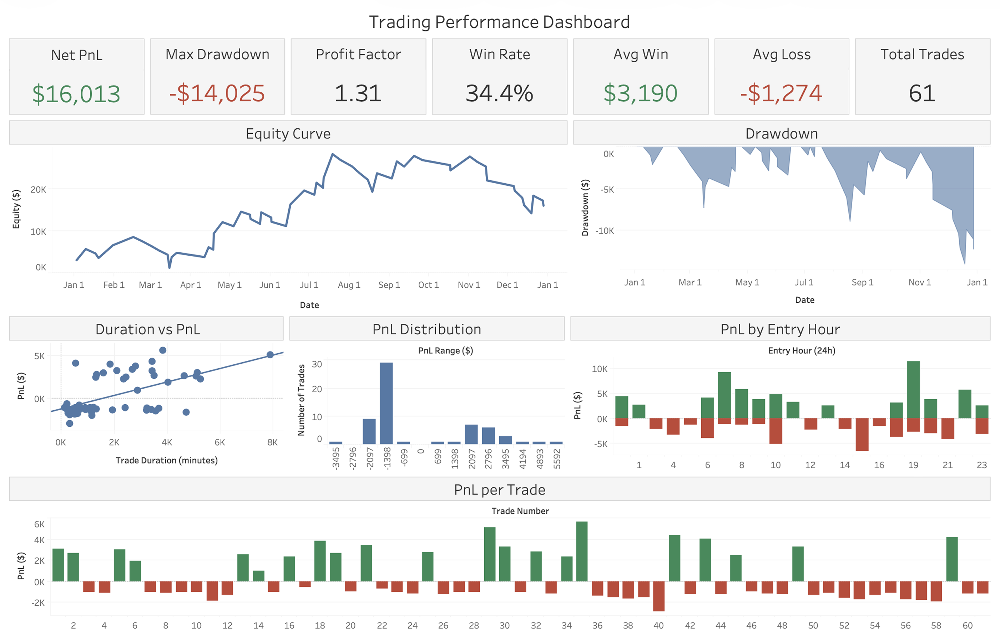
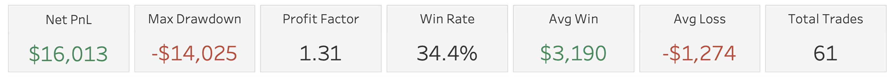
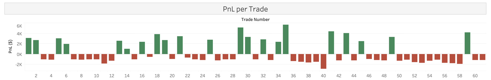

# Trading Performance Dashboard

**Performance Analytics Pipeline — Python + SQL + Streamlit + Tableau**

This project analyzes trading strategy performance and risk metrics using historical trade data. It includes a complete analytics workflow with data processing, KPI calculation, Tableau-ready datasets, and a dark-themed Streamlit dashboard for interactive performance analysis.

Although the example uses trading data, the same pipeline structure applies to financial, operational, and business performance analytics environments.

---

## Dashboard Preview

### Full Dashboard


### KPI Overview


### Equity Curve & Drawdown


### Duration vs PnL, PnL Distribution & Entry Hour Analysis


### PnL per Trade


---

## Tableau Dashboard

[View Interactive Tableau Dashboard](https://public.tableau.com/app/profile/fabio.coelho6106/viz/TradingPerformanceDashboard_17743138751960/TPD)

---

## Analytics Objectives

This project demonstrates:

- Performance analytics
- KPI dashboard design
- Financial analytics
- Data modeling
- ETL workflows
- BI-ready dataset design
- Interactive dashboard development
- Data visualization and reporting

---

## Dashboard Features

- KPI overview cards
- Equity curve visualization
- Drawdown analysis
- PnL distribution analysis
- Trade duration vs profitability
- Time-of-day performance analysis
- Trade-by-trade analysis

---

## Core KPIs

- Win Rate
- Average Win vs Average Loss
- Expectancy (per trade)
- Profit Factor
- Net PnL
- Maximum Drawdown
- Equity Curve Performance

These KPIs mirror the type of performance metrics commonly used in financial analytics, business intelligence, operational reporting, and performance monitoring systems.

---

## Analytics Workflow

### 1. Ingest
Reads structured trade reports from Excel files (`List of trades` sheet). The input path is configurable in `etl/etl_from_excel.py`.

### 2. Transform
Pairs entry and exit rows into unified trade records (one row per trade).

### 3. Model
Builds a clean `trades_fact` dataset optimized for BI and analytics tools.

### 4. Metrics
Calculates performance KPIs such as:

- Win rate
- Expectancy
- Profit factor
- Net PnL
- Average win/loss
- Maximum drawdown

### 5. Output
Exports structured CSV datasets for Tableau and powers the Streamlit dashboard.

> **Note:** Raw proprietary trade exports are not required to explore the repository. Sample CSV outputs are included so the dashboard can run without executing the ETL pipeline.

---

## Outputs (Tableau / BI)

Written to `data/` by the ETL pipeline:

| File | Description |
|------|-------------|
| `data/trades_fact.csv` | One row per trade (timestamps, prices, size, net PnL, run-up, drawdown) |
| `data/equity_curve.csv` | Equity progression and drawdown over time |
| `data/kpis_summary.csv` | Single-row KPI performance snapshot |

---

## Project Layout

```text
├── app/              # Streamlit dashboard
├── data/             # Generated CSVs (ETL output; sample files included for the demo)
├── etl/              # Excel → CSV pipeline
├── sql/              # Ad hoc SQL (e.g. KPIs)
├── screenshots/
├── .streamlit/       # Theme configuration
├── requirements.txt
├── pyproject.toml
└── README.md
```

---

## Technologies Used

- Python
- SQL
- Streamlit
- Tableau
- Pandas
- Data Visualization
- ETL Pipelines
- Performance Analytics

---

## How to Run

From the project root:

```bash
pip install -r requirements.txt
python etl/etl_from_excel.py
```

### Streamlit Dashboard

```bash
streamlit run app/dashboard_app.py
```

(Optional) Create a virtual environment first:

```bash
python -m venv .venv
```

Then activate it and install dependencies.

---

## Linting and Formatting

Configuration is defined in `pyproject.toml` using Ruff.

```bash
pip install ruff
ruff check .
ruff format .
```

### SQL Formatting / Linting

```bash
pip install sqlfluff
sqlfluff lint sql/kpis.sql --dialect sqlite

# Optional auto-fix
# sqlfluff fix sql/kpis.sql --dialect sqlite
```

---

## License

This project is licensed under the MIT License. See [LICENSE](LICENSE) for details.

---

## Author

Fabio Coelho
